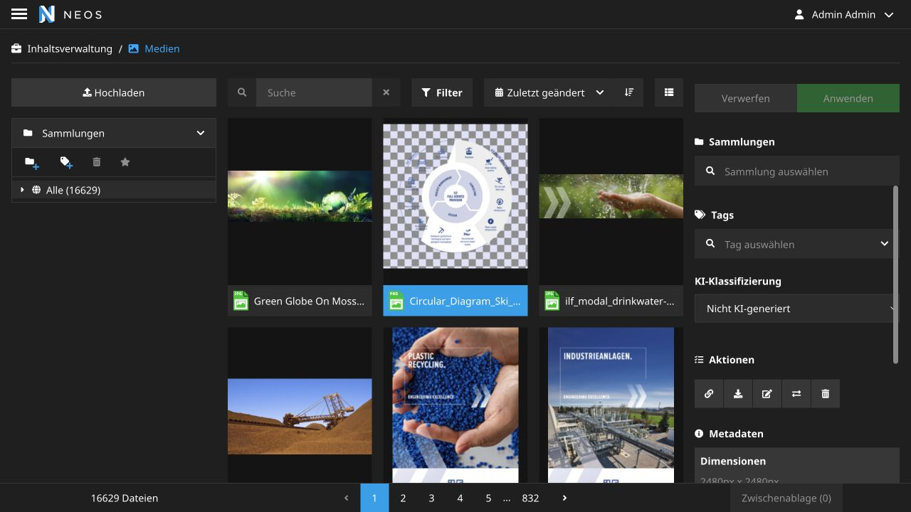

# Media UI Asset AI Labeling

> **Beta:** This package is under active development. Its behavior and public
> integration points may still change before the first stable release.

Adds an exclusive AI classification selector to the asset inspector in
[flowpack/media-ui](https://github.com/Flowpack/media-ui).



## Behaviour

The selector is available for every asset type and maps its options to regular
Neos Media tags:

| Option         | Assigned tags       |
| -------------- | ------------------- |
| `Non-AI`       | Neither AI tag      |
| `AI-generated` | `AI-generated` only |
| `AI-modified`  | `AI-modified` only  |

Existing unrelated tags are preserved. Missing classification tags are created
when first needed. The tag chips, tag tree, filtered asset grid, and result count
update without reloading the module.

The field label and option labels follow the Neos backend interface language:
German (`de`, `de_AT`, or `de-DE`) uses German labels, while English and all
other languages use the English fallback. The persisted tag labels remain
language-independent.

The integration is loaded only in the Media UI module. It does not affect the
asset selector used by the Neos content module.

## Content API integration

Every image rendered through `Networkteam.Neos.Util:ImageUriAndDimensions` and
every generic asset serialized by `Networkteam.Neos.ContentApi:Properties`
contains an additional `aiClassification` field. Its value is either
`AI-generated`, `AI-modified`, or `null`. Image variants inherit the
classification of their original image, while generic assets include videos.

The field is intentionally based on the stable tag labels, so frontend
integrations can map it to localized display text without exposing all media
tags.

## Requirements

- Neos 8.4
- Flowpack Media UI 1.4 or 2.x
- PHP 8.3

## Installation

Require the package from the Neos distribution and publish its resources:

```bash
composer require neosidekick/media-ui-asset-ai-labeling
./flow resource:publish
```

For a local path repository, add the package directory to the distribution and
require it from the site or root package as usual.

## Implementation notes

The package registers one JavaScript resource through
`additionalResources.javaScripts`. The script uses the existing Media UI
GraphQL endpoint and Apollo cache, so no fork or frontend build is required.

The classification tag labels are part of the data contract. If either tag is
renamed or deleted, the package recreates the expected label on the next
classification change.
