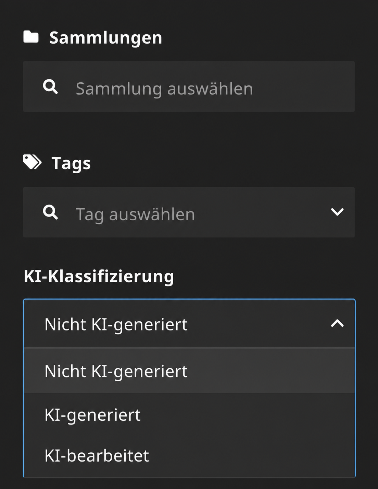

# Media UI Asset AI Labeling

> **Beta:** This package is under active development.

Adds an exclusive AI classification selector to the asset inspector in
[flowpack/media-ui](https://github.com/Flowpack/media-ui).



## Behaviour

The selector is available for every asset type and maps its options to regular
Neos Media tags:

| Option         | Assigned tags       |
| -------------- | ------------------- |
| `Without AI`   | Neither AI tag      |
| `AI-generated` | `AI-generated` only |
| `AI-modified`  | `AI-modified` only  |

Existing unrelated tags are preserved. Missing classification tags are created
when first needed. The tag chips, tag tree, filtered asset grid, and result count
update without reloading the module.

The field label and option labels follow the Neos backend interface language:
German (`de`, `de_AT`, or `de-DE`) uses German labels, while English and all
other languages use the English fallback. The persisted tag labels remain
language-independent.

The integration is loaded in the Media UI module and in the Neos UI content
module, where the same selector appears in the asset details screen that the
inspector image and asset editors open when Flowpack Media UI's
`useNewMediaSelection` feature is enabled. The legacy Neos asset selector is
not affected.

## Fusion EEL helpers

The package registers `AiClassification` in the default Fusion context. Use it
with a single image, image variant, video, or other Neos media asset:

```fusion
aiClassification = ${AiClassification.fromAsset(asset)}
```

For responsive video sources or other asset collections, use:

```fusion
aiClassification = ${AiClassification.fromAssets(assets)}
```

Both methods return `AI-generated`, `AI-modified`, or `null`. Image variants
inherit their original asset's classification. If a collection contains both
classifications, `AI-generated` takes precedence.

When Sitegeist Kaleidoscope is installed, its image sources also expose the
classification directly:

```fusion
aiClassification = ${imageSource.aiClassification()}
```

Asset-backed image sources resolve their original Neos media asset. Dummy,
resource, and URI image sources return `null`.

### Rendering an image with Schema.org microdata

This complete Fusion example renders a Neos image and discloses its digital
source when it is AI-classified:

```fusion
prototype(Vendor.Site:AiClassifiedImage) < prototype(Neos.Fusion:Component) {
    asset = null
    alternativeText = ''

    @private {
        aiClassification = ${AiClassification.fromAsset(props.asset)}
        digitalSourceType = ${AiClassification.schemaOrgDigitalSourceType(private.aiClassification)}
    }

    renderer = afx`
        <figure itemscope="" itemtype="https://schema.org/ImageObject">
            <Neos.Neos:ImageTag
                asset={props.asset}
                attributes.alt={props.alternativeText}
                attributes.itemprop="contentUrl"
            />
            <meta
                @if.has={private.digitalSourceType}
                itemprop="digitalSourceType"
                content={private.digitalSourceType}
            />
        </figure>
    `
}
```

`schemaOrgDigitalSourceType()` also accepts an asset or asset collection
directly when the classification value is not otherwise needed.

## Zebra and Content API integration

If the website uses Zebra, add the optional
`neosidekick/content-api-asset-ai-labeling` package. It adds the classification
to `Networkteam.Neos.ContentApi` output while keeping the Media UI package free
of Content API dependencies:

```bash
composer require neosidekick/content-api-asset-ai-labeling
```

## Requirements

- Neos 8.4
- Flowpack Media UI 1.4 or 2.x
- PHP 8.3

## Installation

Require the package from the Neos distribution and publish its resources:

```bash
composer require neosidekick/media-ui-asset-ai-labeling
./flow resource:publish
```

For a local path repository, add the package directory to the distribution and
require it from the site or root package as usual.

## Implementation notes

The package registers the same JavaScript resource twice, once for the Media
module through `additionalResources.javaScripts` and once for the Neos UI
through `Neos.Neos.Ui.resources.javascript`, plus one EEL helper in the default
Fusion context. The script uses the existing Media UI GraphQL endpoint and
Apollo cache, so no fork or frontend build is required. In both host pages it
installs a `window.fetch` interceptor for the `/neos/graphql/media-assets`
endpoint to keep the selected asset and its tags up to date without extra
queries. The control only renders for assets whose identifier is a UUID, which
means external asset sources are not supported.

The classification tag labels are part of the data contract. If either tag is
renamed or deleted, the package recreates the expected label on the next
classification change.
